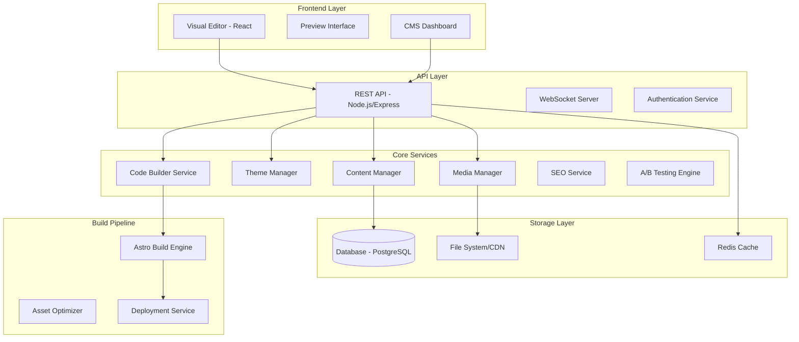
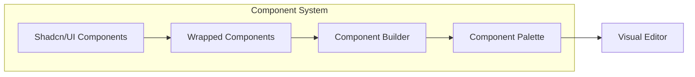

# Design Document

## Overview

The Visual Website Builder is an open-source platform that combines Astro's static site generation capabilities with a powerful visual editor and CMS. Designed as a gift to the developer community, this tool addresses the complexity issues found in existing CMSs while being optimized for AI-powered code builders like Claude, Cursor, and Kiro. The system architecture follows a modular approach with clear separation between the builder interface, content management, and static site generation. The platform leverages Astro's island architecture for optimal performance while providing a rich editing experience through a React 19.2-based visual editor.

### Open Source Philosophy

- **MIT License** for maximum adoption and contribution
- **Modular Architecture** allowing developers to extend and customize
- **AI-First Design** with clean APIs and predictable code generation
- **Developer Experience** prioritized for easy setup and contribution
- **Community-Driven** with clear contribution guidelines and documentation

## Architecture

### High-Level Architecture



### Component Architecture

The system uses a component-driven architecture where each shadcn/ui component is wrapped with builder-specific metadata and capabilities:



## Components and Interfaces

### 1. Visual Editor Interface

**Technology Stack:**

- React 19.2 with TypeScript
- @dnd-kit/core for modern drag-and-drop functionality
- Zustand for state management
- TanStack Query v5 for server state
- Tailwind CSS 4.x for styling

**Key Components:**

```typescript
interface VisualEditorProps {
  pageId: string;
  initialData?: PageData;
  onSave: (data: PageData) => Promise<void>;
}

interface ComponentPalette {
  categories: ComponentCategory[];
  searchFilter: string;
  onComponentSelect: (component: ComponentDefinition) => void;
}

interface Canvas {
  components: ComponentInstance[];
  selectedComponent?: string;
  onComponentAdd: (component: ComponentInstance) => void;
  onComponentUpdate: (id: string, props: any) => void;
  onComponentDelete: (id: string) => void;
}

interface PropertiesPanel {
  selectedComponent?: ComponentInstance;
  onPropertyChange: (property: string, value: any) => void;
}
```

### 2. Component System

**Component Wrapper Interface:**

```typescript
interface WrappedComponent {
  id: string;
  type: string;
  displayName: string;
  category: ComponentCategory;
  props: ComponentProps;
  children?: WrappedComponent[];
  metadata: {
    description: string;
    previewImage: string;
    tags: string[];
    isContainer: boolean;
  };
}

interface ComponentDefinition {
  component: React.ComponentType;
  defaultProps: Record<string, any>;
  propSchema: JSONSchema;
  styleSchema: JSONSchema;
}
```

### 3. Theme Management System

**Theme Interface:**

```typescript
interface Theme {
  id: string;
  name: string;
  colors: {
    primary: string;
    secondary: string;
    accent: string;
    neutral: string;
    base: string;
    info: string;
    success: string;
    warning: string;
    error: string;
  };
  typography: {
    fontFamily: string;
    headingFont?: string;
    fontSize: Record<string, string>;
    fontWeight: Record<string, number>;
    lineHeight: Record<string, string>;
  };
  spacing: Record<string, string>;
  borderRadius: Record<string, string>;
  shadows: Record<string, string>;
}

interface ThemeManager {
  applyTheme(theme: Theme): void;
  generateCSS(theme: Theme): string;
  validateTheme(theme: Theme): ValidationResult;
}
```

### 4. Content Management System

**Content Models:**

```typescript
interface Page {
  id: string;
  slug: string;
  title: string;
  description?: string;
  components: ComponentInstance[];
  seoData: SEOData;
  status: 'draft' | 'published' | 'archived';
  publishedAt?: Date;
  createdAt: Date;
  updatedAt: Date;
}

interface BlogPost extends Page {
  excerpt?: string;
  featuredImage?: string;
  categories: string[];
  tags: string[];
  author: string;
  readingTime: number;
}

interface MediaAsset {
  id: string;
  filename: string;
  originalName: string;
  mimeType: string;
  size: number;
  url: string;
  thumbnailUrl?: string;
  alt?: string;
  tags: string[];
  folder?: string;
  createdAt: Date;
}
```

### 5. SEO Service Interface

```typescript
interface SEOService {
  analyzePage(content: string): SEOAnalysis;
  generateMetaTags(page: Page): MetaTags;
  generateStructuredData(page: Page): StructuredData;
  generateSitemap(pages: Page[]): string;
  optimizeImages(images: MediaAsset[]): Promise<OptimizedAsset[]>;
}

interface SEOAnalysis {
  score: number;
  issues: SEOIssue[];
  recommendations: SEORecommendation[];
}
```

## Data Models

### Database Schema

**Pages Table:**

```sql
CREATE TABLE pages (
  id UUID PRIMARY KEY DEFAULT gen_random_uuid(),
  slug VARCHAR(255) UNIQUE NOT NULL,
  title VARCHAR(255) NOT NULL,
  description TEXT,
  content JSONB NOT NULL,
  seo_data JSONB,
  status VARCHAR(20) DEFAULT 'draft',
  published_at TIMESTAMP,
  created_at TIMESTAMP DEFAULT NOW(),
  updated_at TIMESTAMP DEFAULT NOW()
);
```

**Themes Table:**

```sql
CREATE TABLE themes (
  id UUID PRIMARY KEY DEFAULT gen_random_uuid(),
  name VARCHAR(255) NOT NULL,
  config JSONB NOT NULL,
  is_default BOOLEAN DEFAULT FALSE,
  created_at TIMESTAMP DEFAULT NOW()
);
```

**Media Assets Table:**

```sql
CREATE TABLE media_assets (
  id UUID PRIMARY KEY DEFAULT gen_random_uuid(),
  filename VARCHAR(255) NOT NULL,
  original_name VARCHAR(255) NOT NULL,
  mime_type VARCHAR(100) NOT NULL,
  size INTEGER NOT NULL,
  url VARCHAR(500) NOT NULL,
  thumbnail_url VARCHAR(500),
  alt_text TEXT,
  tags TEXT[],
  folder VARCHAR(255),
  created_at TIMESTAMP DEFAULT NOW()
);
```

**A/B Tests Table:**

```sql
CREATE TABLE ab_tests (
  id UUID PRIMARY KEY DEFAULT gen_random_uuid(),
  name VARCHAR(255) NOT NULL,
  page_id UUID REFERENCES pages(id),
  variants JSONB NOT NULL,
  traffic_split JSONB NOT NULL,
  status VARCHAR(20) DEFAULT 'draft',
  start_date TIMESTAMP,
  end_date TIMESTAMP,
  created_at TIMESTAMP DEFAULT NOW()
);
```

## Error Handling

### Error Categories and Handling Strategy

1. **Validation Errors**
   - Component prop validation
   - Theme validation
   - Content validation
   - User input validation

2. **Build Errors**
   - Astro compilation errors
   - Asset optimization failures
   - Deployment failures

3. **Runtime Errors**
   - API failures
   - Database connection issues
   - File system errors

**Error Handling Implementation:**

```typescript
class ErrorHandler {
  static handleValidationError(error: ValidationError): ErrorResponse {
    return {
      type: 'validation',
      message: error.message,
      field: error.field,
      code: 'VALIDATION_FAILED',
    };
  }

  static handleBuildError(error: BuildError): ErrorResponse {
    return {
      type: 'build',
      message: 'Build failed. Please check your components and try again.',
      details: error.details,
      code: 'BUILD_FAILED',
    };
  }

  static handleRuntimeError(error: Error): ErrorResponse {
    console.error('Runtime error:', error);
    return {
      type: 'runtime',
      message: 'An unexpected error occurred. Please try again.',
      code: 'RUNTIME_ERROR',
    };
  }
}
```

## Testing Strategy

### 1. Unit Testing

- **Component Testing:** Test individual wrapped components and their prop handling
- **Service Testing:** Test theme manager, content manager, and SEO service logic
- **Utility Testing:** Test helper functions and validation logic

### 2. Integration Testing

- **API Testing:** Test REST endpoints and WebSocket connections
- **Database Testing:** Test data persistence and retrieval
- **Build Pipeline Testing:** Test Astro code generation and optimization

### 3. End-to-End Testing

- **User Workflows:** Test complete user journeys from component selection to site deployment
- **Performance Testing:** Test build times and generated site performance
- **Cross-browser Testing:** Ensure compatibility across different browsers

### 4. Visual Regression Testing

- **Component Rendering:** Ensure components render consistently across updates
- **Theme Application:** Verify theme changes apply correctly across all components
- **Responsive Design:** Test component behavior across different screen sizes

**Testing Tools:**

- Vitest for unit testing (faster than Jest)
- React Testing Library for component testing
- Playwright for E2E testing
- Lighthouse CI for performance testing
- Chromatic for visual regression testing

### Open Source Development Considerations

**Developer Experience:**

- **Monorepo Structure** using pnpm workspaces for better dependency management
- **TypeScript-first** with strict type checking for better AI code generation
- **ESLint + Prettier** with standardized configurations
- **Husky + lint-staged** for pre-commit hooks
- **Conventional Commits** for automated changelog generation
- **GitHub Actions** for CI/CD with automated testing and releases

**AI-Friendly Architecture:**

- **Clear API Contracts** with OpenAPI specifications
- **Predictable File Structure** following established conventions
- **Comprehensive JSDoc** comments for better AI understanding
- **Type-safe Database Queries** using Drizzle ORM
- **Standardized Error Handling** with consistent error types
- **Modular Components** with clear separation of concerns

### 5. Performance Monitoring

- **Build Performance:** Monitor Astro build times and optimization effectiveness
- **Runtime Performance:** Track editor responsiveness and user interaction latency
- **Generated Site Performance:** Continuous monitoring of Lighthouse scores and Core Web Vitals

The design ensures scalability, maintainability, and performance while providing a rich user experience for both content creators and end users. The modular architecture allows for independent development and testing of different system components while maintaining clear interfaces between them.

##

Technical Stack Summary

**Frontend:**

- React 19.2 with TypeScript 5.x
- Tailwind CSS 4.x for styling
- @dnd-kit/core for modern drag-and-drop
- Zustand for state management
- TanStack Query v5 for server state

**Backend:**

- Node.js with Fastify (faster than Express)
- PostgreSQL with Drizzle ORM for type-safe queries
- Redis for caching and sessions

**Build & Development:**

- Astro 5.x for static site generation
- Vite 6.x for fast development and building
- pnpm for efficient package management
- Vitest for testing (faster than Jest)

**Open Source & AI-Friendly Features:**

- MIT License for maximum adoption
- Monorepo structure with clear module boundaries
- Comprehensive TypeScript definitions for AI code generation
- OpenAPI specifications for predictable API contracts
- Conventional commit standards for automated releases
- GitHub Actions for CI/CD automation

This modern stack ensures the platform is fast, maintainable, and optimized for both human developers and AI-powered development tools.
